<p align="center">
  <picture>
    <source media="(prefers-color-scheme: dark)" srcset="brand/assets/lockups/avr-stacked-dark.svg">
    
  </picture>
</p>

<h1 align="center">AVR ecosystem</h1>

<p align="center"><b>Своё. Для своих.</b><br>
Музыка, видео, мессенджер и сайты для небольшой компании друзей — в одном стиле, на своём сервере.</p>

<p align="center">
  <a href="https://github.com/avtohauser/AVRmusic/releases/latest"></a>
  <a href="https://github.com/avtohauser/AVRmusic/actions/workflows/deploy.yml"></a>
  
  
</p>

| | Что это | Где | Состояние |
|---|---|---|---|
| **avr music** | частный стриминг музыки: Android, iPhone, сайт | `apps/`, `android/`, `packages/` | работает |
| **avrtube** | видео без рекламы на движке NewPipe: Android и iPhone, связан с avr music | `tube/` | в работе |
| **avrgram** | Telegram для Android с режимом призрака и защитой | `gram/` | в работе |
| **сайты** | сайты на avthsr.space в общем стиле (кроме kgs, lks54 и old) | `sites/` | в работе |
| **бренд avr** | звезда, логотип музыки, надписи, иконки, цвета обеих тем, шрифты, движение, UI-кит | [`brand/`](brand/README.md) | готов |

Всё в одном репозитории: общий стиль из `brand/` берут и сайты, и приложения; сборки и выкладка — через GitHub Actions.

---

# avr music

<p align="center">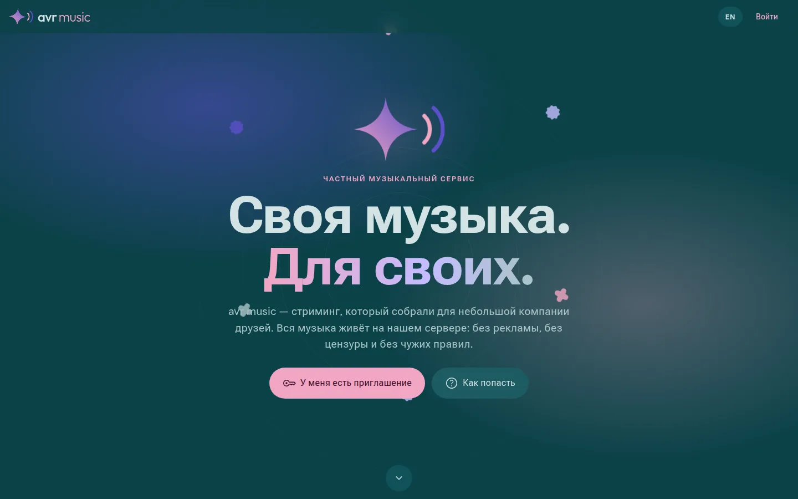</p>

### Зачем это

Стриминги решают за слушателя: что ему показать, что убрать из каталога и в каком виде оставить песню. avr music
устроен наоборот:

- **Для своих.** Вход только по одноразовому приглашению. Нет рекламы, слежки и посторонних — только друзья и их музыка.
- **Музыка остаётся с нами.** Трек, попавший на сервер, лежит на нашем диске: его не удалят по чужому решению,
  не перезальют и не спрячут за подпиской.
- **Оригиналы, а не «чистые» версии.** При поиске звука сервис предпочитает исходные записи: перезалитые версии
  с вырезанными словами (clean, edited, «без мата», переиздания после 1 марта 2026 года) уходят вниз.
- **Красиво и одинаково везде.** Один дизайн — Material 3 Expressive с фирменной звездой, морфящимися формами
  и волнистыми полосками — на Android, iPhone и в браузере.

### Как это выглядит

<table>
  <tr>
    <td>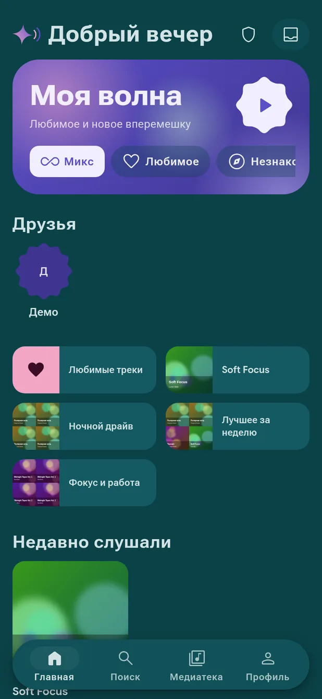</td>
    <td>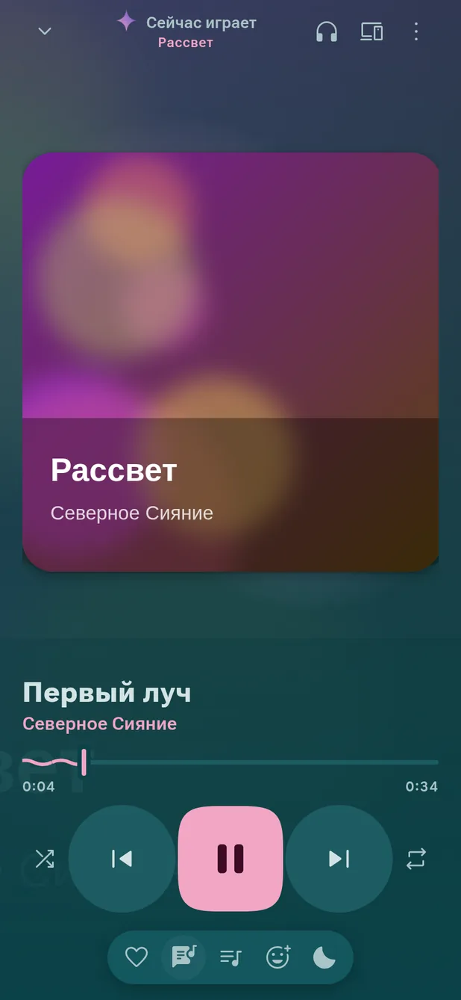</td>
    <td>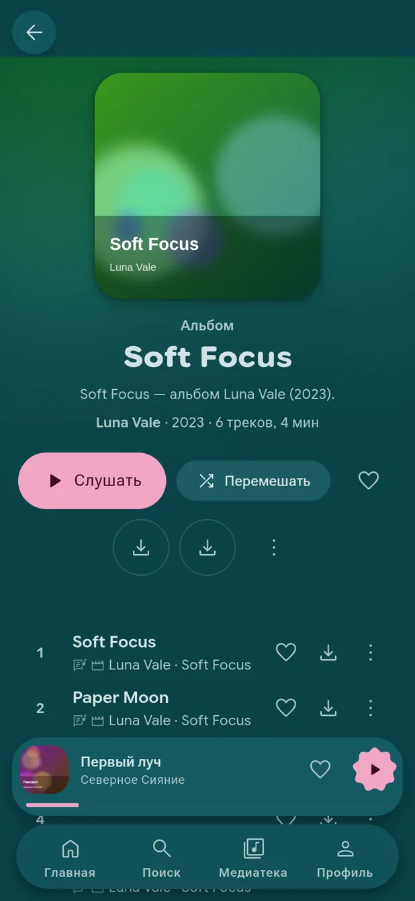</td>
    <td>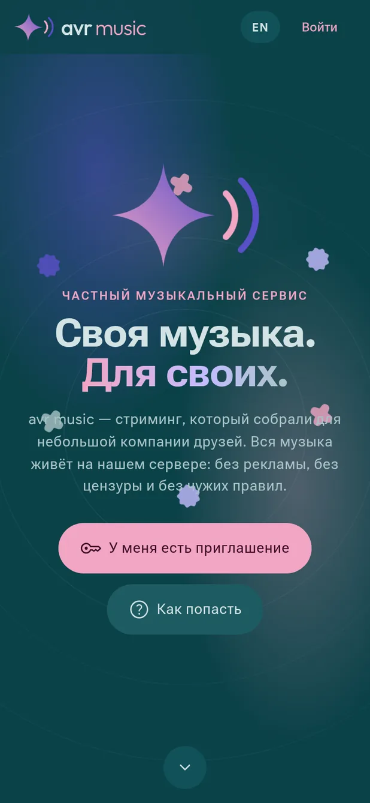</td>
  </tr>
  <tr>
    <td align="center">Главная и «Моя волна»</td>
    <td align="center">Плеер</td>
    <td align="center">Альбом</td>
    <td align="center">Для гостей</td>
  </tr>
</table>

<p align="center">
  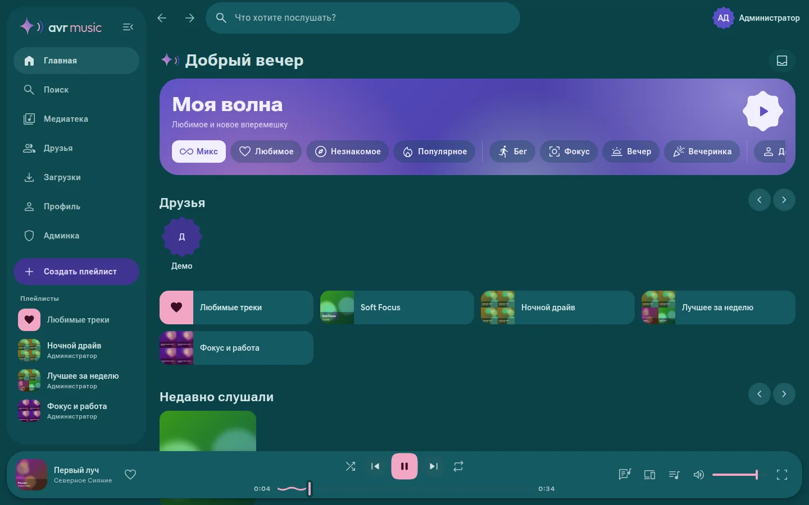
  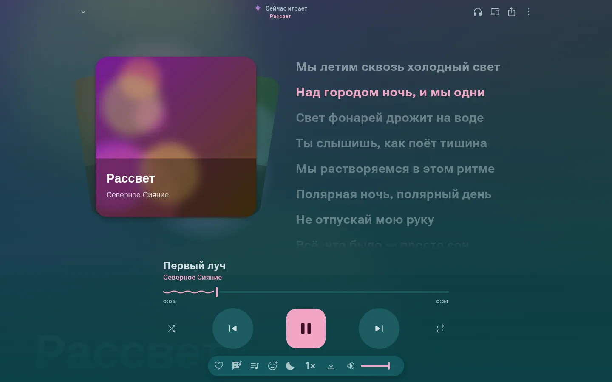
</p>

### Что внутри

**Слушать**
- **Моя волна** — бесконечный поток под настроение (микс, любимое, незнакомое, бег, фокус, вечер, вечеринка) или по вкусу друга; **миксы дня** по любимым жанрам.
- **Любой трек — сразу.** Нашли песню в мировом каталоге — она играет целиком через секунду, а сервер тем временем её скачивает.
- Тексты с подсветкой по словам (караоке), текст на экране блокировки, канвасы — зацикленные видео за треком.
- Плавные переходы, эквалайзер, выравнивание громкости, таймер сна, будильник, скорость.
- Офлайн: треки и плейлисты на телефоне, автоскачивание любимого.

**Вместе**
- Друзья и что они слушают прямо сейчас; **слушать вместе** — одна очередь и голосование за следующий трек, или просто следовать за другом.
- Отправка треков, реакции на моменты песни, общие плейлисты, «Блендер» на двоих, совпадение вкусов.
- **Угадай мелодию** — игра на скорость по своей же музыке, приглашения приходят уведомлением.
- Ачивки, которые выдаёт администратор и которые летают вокруг аватарки; итоги месяца и года в виде историй.

**Библиотека**
- Мировой каталог (метаданные Deezer): дискографии, синглы, фиты, похожие исполнители. Кнопка «+» — и альбом или вся дискография едут на сервер.
- Проверка альбома на целостность и «Докачать альбом»; дискографии любимых артистов подтягиваются сами.
- Переезд из **Spotify** и **Яндекс Музыки**, импорт по ссылке, загрузка своих файлов (в том числе lossless).
- Умные плейлисты по правилам, радар новинок, «В этот день», чарт компании и воскресный дайджест.

**Устройства и сервисы**
- Свои устройства видят друг друга: что где играет, управление и передача музыки с телефона на компьютер и обратно.
- Что вы слушаете — в описании вашего **Telegram**; бот в Telegram, скробблинг в **Last.fm**, концерты в вашем городе.
- Приложение для Android **обновляется само**: уведомление и тихая установка после первого разрешения.
- Виджет, Android Auto, Chromecast и AirPlay; бесшовное воспроизведение на iPhone.

### Как попасть

1. **Попросите приглашение** у друга, который уже внутри: код одноразовый, его создают в админке.
2. **Зарегистрируйтесь** с кодом на сайте или в приложении.
3. **Слушайте** где удобно:

| Платформа | Как поставить |
|---|---|
| **Android 6+** | [Последний APK](https://github.com/avtohauser/AVRmusic/releases/latest) — дальше приложение обновляется само |
| **iPhone / iPad (iOS 16+)** | IPA из [релизов](https://github.com/avtohauser/AVRmusic/releases) (тег `ios-v…`), ставится через [AltStore](https://altstore.io) или [Sideloadly](https://sideloadly.io) с вашим Apple ID |
| **Браузер** | Сайт сервиса; устанавливается как приложение (PWA) |

Гости без кода видят страницу-презентацию (`/welcome` на сайте, листалка при первом запуске приложения).

### Устройство

```
android/shared   Kotlin Multiplatform + Compose Multiplatform: весь интерфейс и логика приложения для Android и iOS
                 (Material 3 Expressive, Ktor, kotlinx.serialization, Coil)
android/app      оболочка Android: плеер Media3 (фон, экран блокировки, Android Auto, Cast), виджет, обновления
android/iosApp   оболочка iOS на Swift; плеер AVPlayer (очередь без пауз, AirPlay, экран блокировки)
apps/api         Fastify 5 + SQLite (better-sqlite3, FTS5): библиотека, стриминг с Range, каталог, очередь задач,
                 поиск звука (yt-dlp и открытые источники), друзья, совместное прослушивание, Telegram, Last.fm
apps/web         React 19 + Vite 7 + Tailwind 4 + TanStack Query + Zustand, веб-компоненты M3E, PWA (Workbox)
packages/shared  общие TypeScript-типы контракта API
deploy/          установщик сервера, Caddy/nginx, сторож и копирование на сервер-хранилище
```

**CI/CD** (GitHub Actions):

| Workflow | Что делает |
|---|---|
| `deploy.yml` | на каждый push выкатывает сервер и сайт (Docker), проверяет, что сервис поднялся |
| `android.yml` | собирает подписанный APK (R8) и публикует релиз `android-v…` — приложения обновятся сами |
| `ios.yml` | на каждый push проверяет, что iOS-код компилируется; по кнопке собирает IPA на macOS |
| `storage.yml` | обслуживание второго сервера с музыкой: перенос, проверка, сторож |

Секреты (доступ к серверам, ключи сервисов) живут только в GitHub Secrets и в админке сервиса; в репозитории
и в логах сборок их нет.

### Поднять у себя

**Разработка:**

```bash
pnpm install
cp apps/api/.env.example apps/api/.env   # поправьте JWT_SECRET и пути
pnpm seed                                 # демо-библиотека: admin / admin123, demo / demo123
pnpm dev                                  # API на :8080 + сайт на http://localhost:5173
```

Без `seed` первый зарегистрированный пользователь становится администратором. Тесты API — `pnpm test`.

**Docker:**

```bash
cp apps/api/.env.example .env
docker compose up -d --build
```

Образ включает `ffmpeg` и `yt-dlp`. Тома: `./data` (база), `./media` (треки, обложки, канвасы), `./music`
(своя коллекция для сканирования, только чтение).

**Сервер с доменом и HTTPS:** установщик `deploy/install.sh` ставит Docker, поднимает сервис и реверс-прокси.
Если на сервере уже работает nginx с другими сайтами, добавляется только один конфиг для домена — остальное не трогается;
сертификат выпускает certbot. Для выката из GitHub Actions заведите secrets `SERVER_HOST`, `SERVER_USER`,
`SERVER_PASSWORD` (или `SERVER_SSH_KEY`) и variable `DOMAIN`.

<details>
<summary><b>Основные переменные окружения</b></summary>

| Переменная | Назначение |
|---|---|
| `JWT_SECRET` | секрет токенов — **обязательно свой** |
| `PUBLIC_URL` | публичный адрес сервиса |
| `DATA_DIR` / `MEDIA_DIR` / `MUSIC_DIR` | база / медиафайлы / коллекция для сканирования |
| `ALLOW_REGISTRATION` | регистрация (по кодам приглашений) |
| `PUBLIC_LIBRARY` | гости могут слушать без входа |
| `CATALOG_ENABLED` | мировой каталог метаданных |
| `ACQUIRE_ROLE` | кто может пополнять библиотеку: `user` / `admin` / `off` |
| `ACQUIRE_SOURCES` | источники звука по приоритету: `youtube,audius,archive,soundcloud,jamendo` |
| `CANVAS_AUTO` | канвасы из официальных клипов |
| `YTDLP_PATH`, `FFMPEG_PATH` | пути к инструментам |

Ключи Telegram-бота, Last.fm, Spotify и аккаунты YouTube задаются в админке и хранятся только на сервере.
</details>

### Откуда берётся музыка

Метаданные и обложки — из публичного API Deezer, тексты — LRCLIB. Звук сервис находит сам в открытых источниках
(YouTube и SoundCloud через yt-dlp, Audius, Internet Archive, Jamendo), сверяя название, исполнителя, длительность
и официальность загрузки. Можно загружать и свои файлы. Инструментов для снятия защиты со стриминговых сервисов
и торрентов в проекте нет — используйте только то, на что у вас есть права.

---

# Бренд avr

Основа — **просто звезда** и слово **avr** с припиской продукта: avr music, avrtube, avrgram, avr studio. Звезда одна
на всех; звезда с двумя волнами — это логотип avr music. Дальше — Material 3
Expressive в фирменных цветах: тёмная схема (глубокая бирюза) и светлая (бумага), Google Sans Flex и Roboto Flex с
переменными осями, формы-«печеньки», пружинистое движение. Звезда работает и как фон (звёздное поле, большая звезда),
и как анимация (заставка, лоадер, мерцание, искры, переход между продуктами).

<p align="center">
  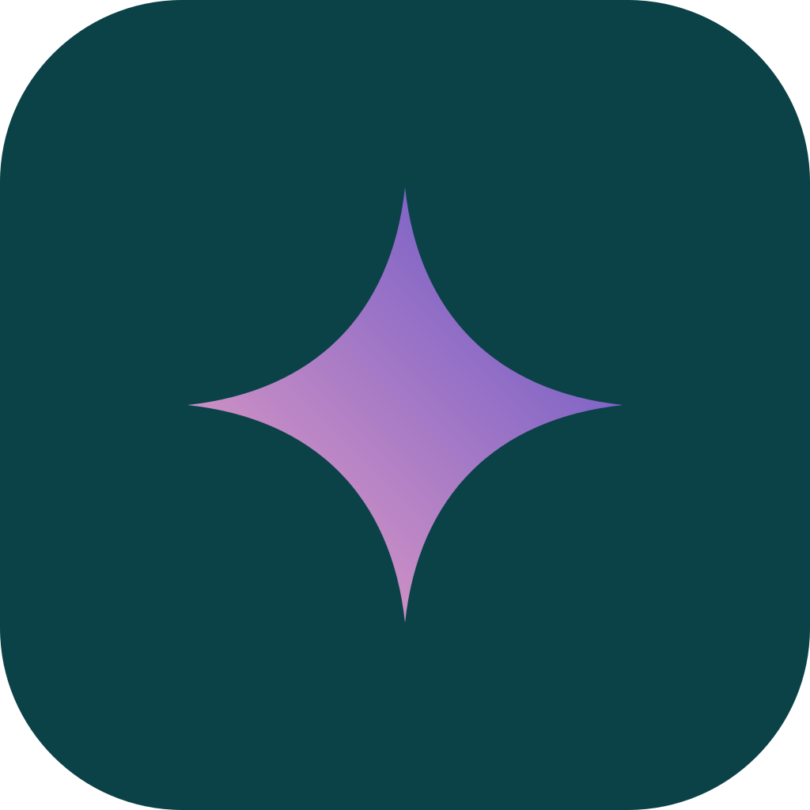
  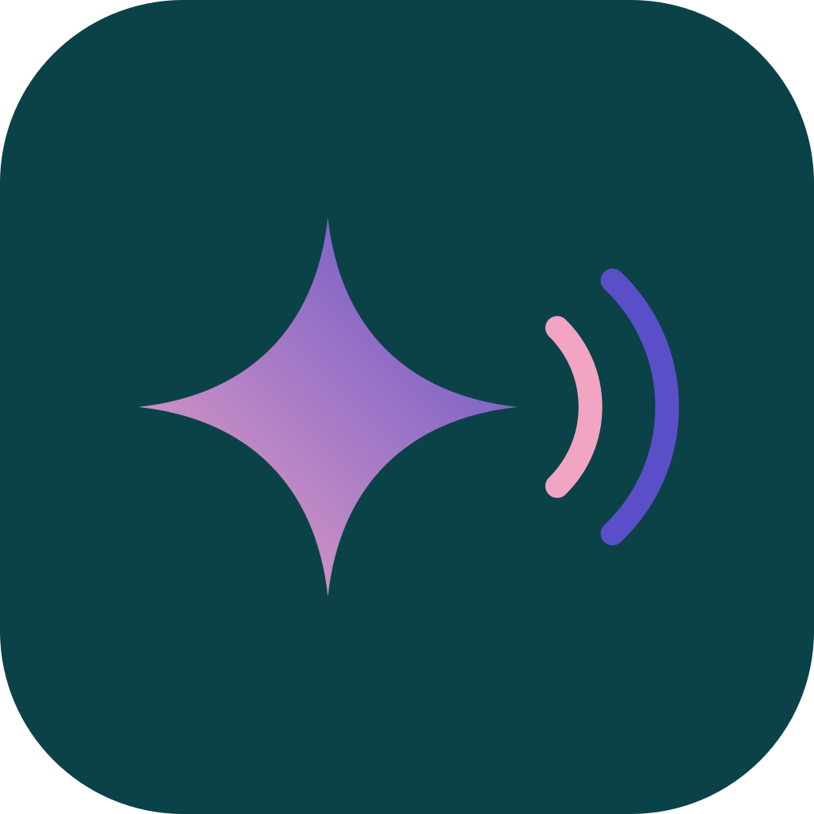
  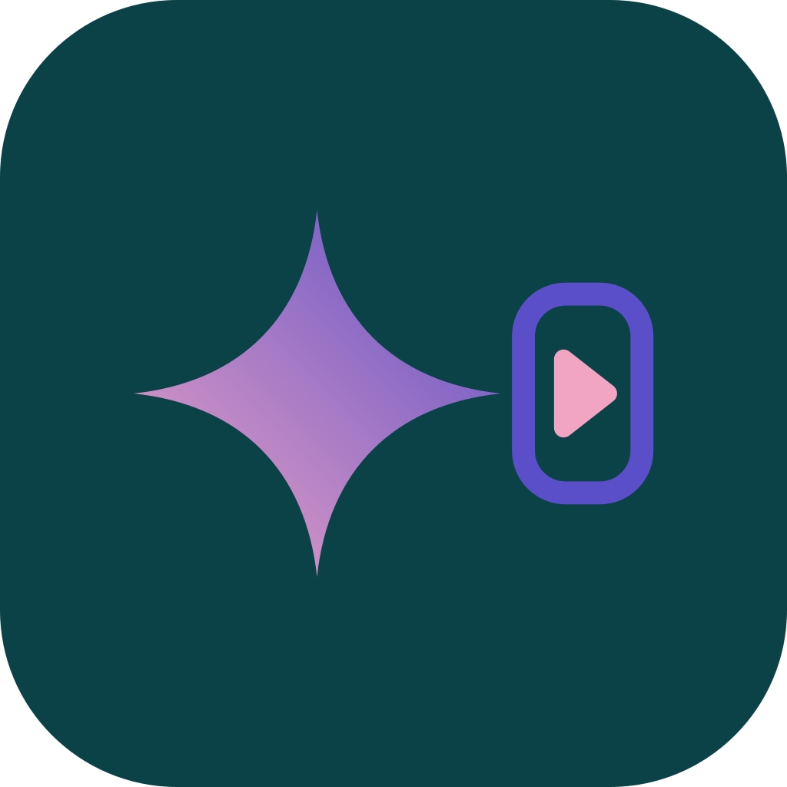
  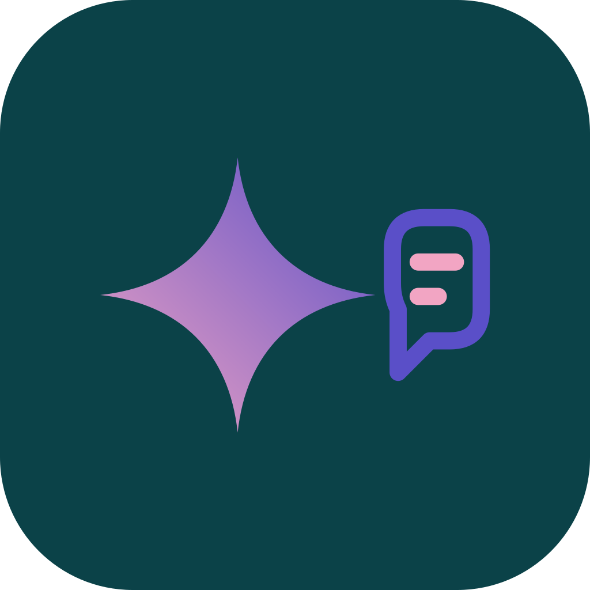
</p>

Брендбук — [`brand/README.md`](brand/README.md) и живой [`brand/index.html`](brand/index.html); файлы — `brand/assets/`
(генерируются `brand/tools/`). Сайтам хватает `brand/avr.css` и `brand/avr.js`, приложения берут те же значения из
Compose-темы.

# Сайты

`sites/` — сайты на avthsr.space. Workflow **sites** снимает их публичную часть (как видит браузер) в
`sites/mirror/`, дальше каждый сайт переводится на стиль avr и выкладывается через Actions. kgs и lks54 не трогаем, old остаётся
в своём стиле web 1.0.

## Лицензия

MIT
